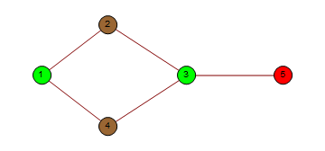

# Graph Coloring

Graph Coloring usign Gröbner basis theory.

## Description

This is a small programm written in Mathematica that finds all the vertex colorations with 3 or 4 colors. The only constraint is that no two adjacent vertices share the same color

- For 3 colors, it uses the field Z3. 
- For 4 colors, it uses the set of the complex numbers and the 4th-roots of the unity

The output is interactive and it shows you all the possible vertex colorations (as shown in the image above).

## Loading and usage

See [example.pdf](https://github.com/ranea/Graph-Coloring/blob/master/example.pdf)

