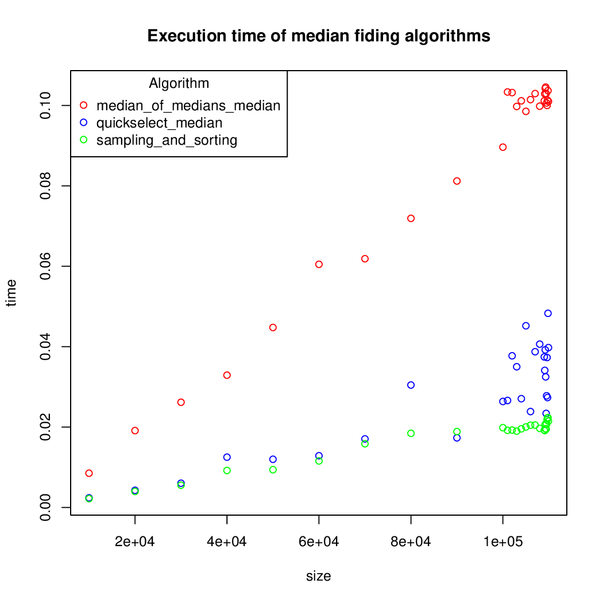

# Comparison of median finding algorithms

This experiment compare the execution time of three algorithms that find the median of a vector: quickselect, median of medians and the sampling-and-sorting algorithm.

## The experiment

The three median finding algorithms are implemented in pure Python 3. The source code of these algorithms are stored in *algorithms/*.

To validated the implementations, *algorithms/tests.py* compares this three median implementations with the Python built-in implementation (using the property-based testing library 

The random vectors used as inputs are generated by *random_vectors.py*.
Note that our implementation for the sampling-and-sorting algorithm requires the vector size to be even and the elementos of the vector to be distinct.

To extract the execution time for a given implementation and input, the execution time is measured three times and the minimum is taken. This is implemented in *benchmark.py*. No means or standard deviation are computed as the [Python Official Documentation] (https://docs.python.org/3.6/library/timeit.html#timeit.Timer.repeat) suggests.

Finally, a graphic representation of the comparison is obtained with the R script *plotting.r*.

## Running the experiment

Python 3 and R must be installed to execute the experiment.

1. Generate the random vectors:

    python3 random_vectors.py vector.csv

2. Run the benchmark:

    python3 benchmark.py vector.csv execution_time.csv

3. Plot the execuion time:

    Rscript execution_time.csv

